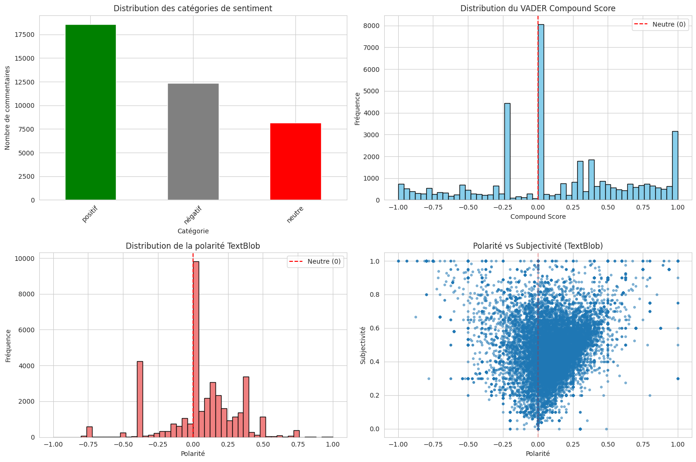
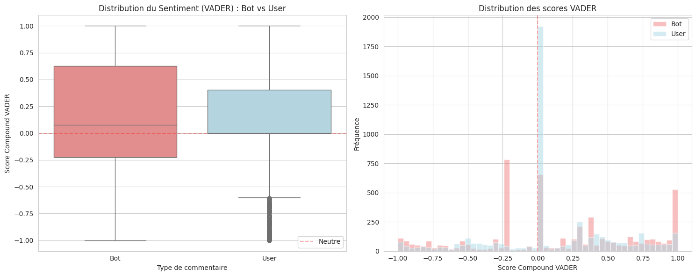
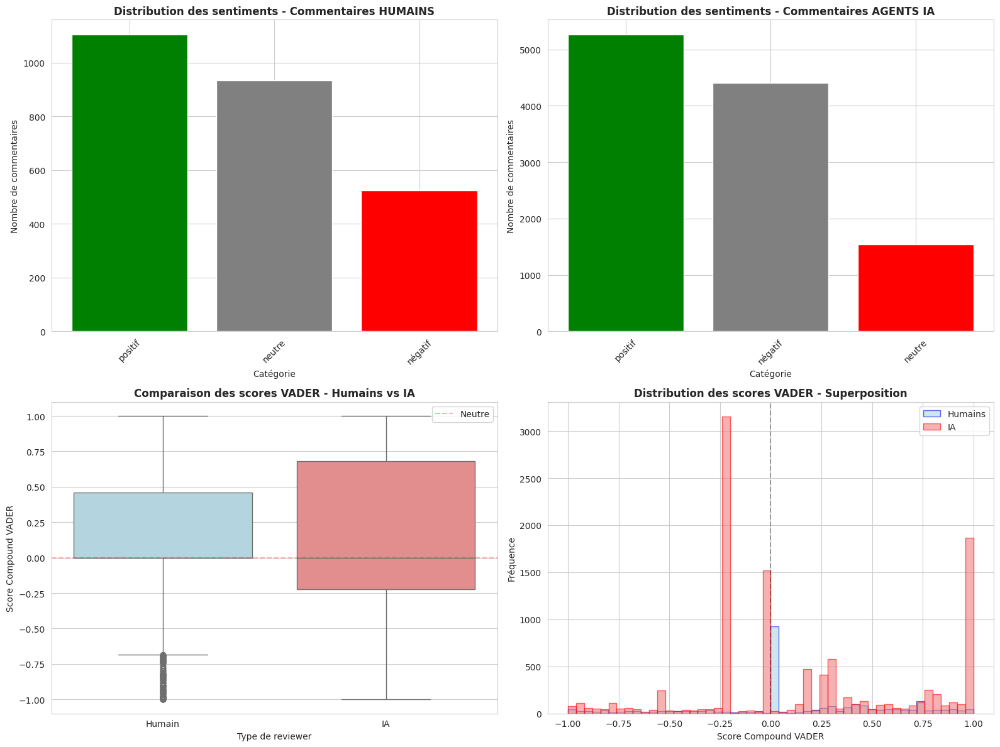
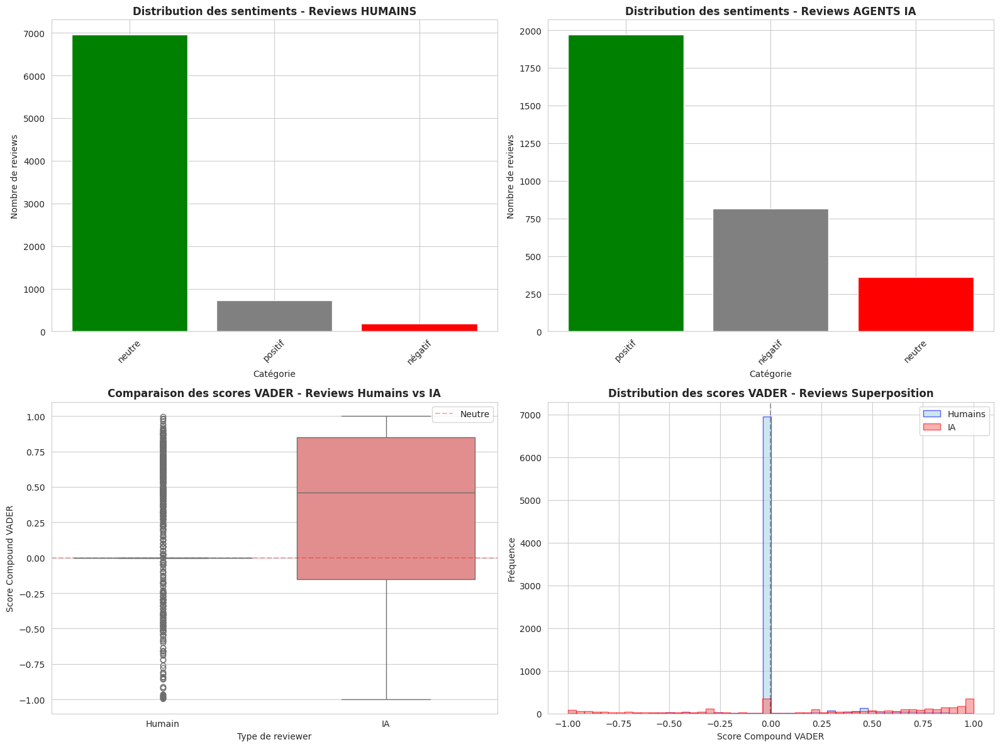

MGL869 – L’ingénierie de mise en production des versions logicielles  

# Travail individuel sur l’analyse de sentiment des revues de code réalisées par des agents IA et des reviewers humains  

Version 1  

**Étudiant :** Sergio Escobar Beltran  
**Code permanent :** ESCS18338601  

**Remis le :** 11-12-2025  
**Session :** A2025  
**Professeur :** Mohammed Sayagh  

---
## Table des matières

- [1. Objectif du projet](#1-objectif-du-projet)
- [2. Contexte et motivation](#2-contexte-et-motivation)
- [3. Hypothèses de recherche](#3-hypothèses-de-recherche)
- [4. Méthodologie](#4-méthodologie)
- [5. Évaluation](#5-évaluation)
- [6. Résultats](#6-résultats)
- [7. Conclusions et travaux futurs](#7-conclusions-et-travaux-futurs)
- [Références](#références)

---

## 1. Objectif du projet  
Déterminer si les reviewers manifestent des attitudes plus positives (sentiment, politesse, bienveillance, absence de critique dure) dans leurs commentaires lorsqu’ils évaluent des *pull requests* (PR) générées par des agents d’intelligence artificielle, comparativement à des PR évaluées par des humains.

---

## 2. Contexte et motivation  
Avec l’essor des agents de codage autonomes alimentés par l’intelligence artificielle, tels que GitHub Copilot, OpenAI_Codex, Devin, Cursor ou Claude_Code, le paysage du développement logiciel connaît une transformation majeure. Ces agents assistent les développeurs en générant du code, en suggérant des améliorations et en automatisant des tâches répétitives. Toutefois, leur intégration dans les flux de travail collaboratifs soulève d’importantes questions quant à la dynamique d’équipe et aux modes de communication. Il devient alors essentiel de comprendre comment les développeurs perçoivent et évaluent les contributions issues de l’IA, notamment à travers les commentaires formulés lors des revues de code.

---

## 3. Hypothèses de recherche  

**H0 — Hypothèse nulle**  
Il n’existe aucune différence significative dans le ton (sentiment, politesse, bienveillance) des commentaires de revue entre ceux générés par des agents IA et ceux rédigés par des reviewers humains lors de l’évaluation de PR produites par des agents IA.

**H1 — Hypothèse alternative**  
Les agents IA utilisent un ton significativement plus positif et bienveillant que les reviewers humains lorsqu’ils commentent des PR générées par des agents IA.

---

## 4. Méthodologie  

1. **Collecte et filtrage des données**  
   Extraction des commentaires à partir du jeu de données AIDev (plus de 39 000 commentaires). L’ensemble des PR analysées dans cette étude sont générées par des agents IA, **car le sous-ensemble de *pull requests* humaines fourni dans AIDev ne contient ni commentaires ni reviews exploitables pour une analyse de sentiment.**. La distinction entre reviewers humains et agents IA est effectuée via la colonne `user_type` (Bot vs User). Les bots opérationnels non dédiés à la revue de code (p. ex. `github-advanced-security[bot]`, `github-actions[bot]`, `sourcery-ai[bot]`) sont explicitement exclus. Les commentaires retenus proviennent soit d’utilisateurs humains (`User`), soit de véritables agents IA de revue (`Bot`, hors liste d’exclusion), et uniquement sur des PR évaluées par un seul type de reviewer (PR « uniquement humaines » vs PR « uniquement IA »).

2. **Analyse de sentiment**  
   Une double analyse par VADER et TextBlob est appliquée dans le notebook `sentiment_analysis.ipynb` (Étapes 4 à 10 et 14–15). Chaque commentaire est enrichi par des scores `neg`, `neu`, `pos`, `compound`, ainsi que par les indicateurs `polarity` et `subjectivity`. Une catégorisation finale du sentiment (positif / neutre / négatif) est produite. Une colonne correspondant à la longueur des commentaires (nombre de mots) est également calculée afin de comparer la granularité des retours.

3. **Comparaison statistique**  
   Un échantillon équilibré de commentaires IA vs humains est constitué par stratification selon `user_type`. Des statistiques descriptives sont calculées, puis un test de Mann-Whitney U est appliqué sur le score `compound` de VADER (Étapes 13 et 14) afin d’évaluer les différences de ton moyen entre les deux groupes. Des visualisations (boxplots, histogrammes) permettent d’inspecter la distribution des scores.

4. **Analyse ciblée des commentaires négatifs**  
   Une analyse spécifique (Étape 15) isole les commentaires classés comme « négatifs » pour les agents IA et pour les humains, à partir des tables `pr_comments` (pour les commentaires) et `pr_reviews` (pour les reviews). Au total, **2 566 commentaires humains**, **11 221 commentaires d’agents IA**, **7 868 reviews humaines** et **3 145 reviews d’agents IA** ont été analysés. Nous examinons leur fréquence, leur longueur moyenne ainsi que les mots-clés dominants (p. ex. *error*, *bug*, *fail*, *remove*, *unnecessary*) afin de comparer les profils sémantiques entre les deux groupes.

5. **Contrôles et limites**  
   Les variables complémentaires (longueur des commentaires, `user_type`, type de message « comment » vs « review ») sont utilisées pour contextualiser les résultats. Toutefois, certaines variables de confusion potentielles (langage de programmation, taille de la PR, projet, configuration précise de l’agent IA) ne sont pas encore intégrées dans cette analyse.

---

## 5. Évaluation  
- Le notebook `sentiment_analysis.ipynb` documente l’ensemble du pipeline expérimental, depuis la préparation des données (Étapes 1 à 3) et le filtrage des bots non pertinents, jusqu’aux comparaisons statistiques (Étapes 11 à 14) et à l’analyse ciblée des commentaires négatifs (Étape 15).  
- Les ajustements apportés à la source de données (exclusion des bots opérationnels, séparation stricte entre PR « uniquement humaines » et PR « uniquement IA ») permettent de mieux aligner l’échantillon avec l’hypothèse de recherche et de réduire le biais lié aux commentaires purement automatiques.

---

## 6. Résultats  

- **Distribution du corpus filtré** : 39 122 commentaires sur des PR générées par des agents IA, dont 27 416 (≈ 70 %) attribués à des agents de revue automatisés (bots IA) et 11 706 (≈ 30 %) à des utilisateurs humains, après exclusion des bots opérationnels.

- **Tonalité moyenne (VADER)** : Le score moyen `compound` est d’environ 0,143 pour les commentaires des agents IA contre 0,100 pour ceux des humains (différence ≈ +0,043). Le test de Mann-Whitney U indique une différence statistiquement significative (p < 0,001).  

- **Catégories de sentiment** :  
  - **Agents IA** : profil plus polarisé, avec une proportion plus élevée de commentaires positifs, mais également une part non négligeable de commentaires négatifs.  
  - **Humains** : profil plus équilibré, avec une majorité de commentaires neutres et une répartition plus modérée entre le positif et le négatif. 
  
  - La Figure 1, `distribution_categories_sentiments_VADER_SCORE.png`,
  présente la distribution globale des catégories de sentiment
  (positif, négatif, neutre) pour l’ensemble des commentaires
  analysés. On observe une prédominance des commentaires positifs,
  suivis des commentaires négatifs, puis des neutres, ce qui indique
  un ton globalement plutôt favorable dans les revues de code.

  - **Distribution du score VADER** :  
  La Figure 2, `distribution_sentiment_VADER_SCORE.png`, illustre
  la distribution du score `compound` de VADER pour l’ensemble des
  commentaires. La majorité des valeurs se situe légèrement au‑dessus
  de 0, ce qui confirme un ton globalement plutôt positif, tout en
  laissant apparaître une proportion non négligeable de commentaires
  plus critiques du côté des scores négatifs.

- **Longueur moyenne des commentaires** : Les commentaires des agents IA sont en moyenne environ trois fois plus longs que ceux des humains (environ 170 mots contre 60 mots), tant pour les sentiments positifs que négatifs, ce qui suggère un style de rétroaction plus détaillé et explicite.  

- **Analyse des commentaires négatifs** : Malgré un ton globalement plus positif, les agents IA produisent un volume non trivial de commentaires négatifs. Ceux-ci contiennent fréquemment un vocabulaire technique lié à la qualité du code (*bug*, *error*, *fail*, *remove*, *unnecessary*). Ces commentaires sont généralement plus longs et plus argumentés que ceux des humains. 
La Figure 3 (`distribution_negatives_comments.png`) montre la
distribution des sentiments pour les commentaires humains vs IA.

La Figure 4 (`distribution_negatives_reviews.png`) montre la
distribution des sentiments pour les reviews humaines vs IA.

> **La « négativité » détectée chez les agents IA reflète donc
> davantage une activité de signalement et d’explication des défauts
> qu’une tonalité émotionnelle défavorable, les outils d’analyse
> classant comme négatifs les termes techniques associés aux erreurs.

> On observe également que, pour les reviews humaines, la distribution
> est majoritairement neutre avec très peu de reviews réellement
> négatives, tandis que pour les reviews d’agents IA, la proportion
> de reviews négatives est plus élevée mais reste inférieure à celle
> des reviews positives.**

- **Conclusion statistique** : L’hypothèse nulle H0 est rejetée. Les commentaires générés par les agents IA de revue sont globalement plus positifs, plus longs et plus structurés que ceux des reviewers humains, tout en intégrant également des formulations critiques pour signaler les défauts.

---

## 7. Conclusions et travaux futurs  

- **Synthèse** : Les reviewers automatisés adoptent un ton plus positif et produisent des commentaires plus détaillés, tandis que les humains fournissent des retours plus concis et plus modérés. Ces résultats confirment l’hypothèse H1 et suggèrent que la présence d’agents IA modifie la dynamique des revues de code.  

- **Travaux futurs** :  
  1. Intégrer des variables de contexte supplémentaires (langage, taille de la PR, type précis d’agent IA).  
  2. Analyser le lien entre le ton des commentaires et l’issue de la PR (acceptation, temps de fusion, nombre de corrections).  
  3. Étendre l’étude à d’autres plateformes (GitLab, Bitbucket) afin d’évaluer la généralisabilité des résultats.  

---

## Références

Li, H., Zhang, H., & Hassan, A. E. (2025). *The rise of AI teammates in software engineering (SE 3.0): How autonomous coding agents are reshaping software engineering*. arXiv. https://arxiv.org/abs/2507.15003

Li, H. (2025). *AIDev: AI-powered software development dataset* [Jeu de données]. Hugging Face. https://huggingface.co/datasets/hao-li/AIDev

Escobar Beltran, S. (2025). *Sentiment analysis of code review comments on AI-generated pull requests* [Notebook Jupyter]. Google Colab. https://colab.research.google.com/drive/1dEeFivZ3o0DhkqO0RRygTZ2rqKk3JH0Y

Escobar Beltran, S. (2025). *MGL869-01-2026-mining-challenge* [Repository GitHub]. GitHub. https://github.com/serghino/MGL869-01-2026-mining-challenge